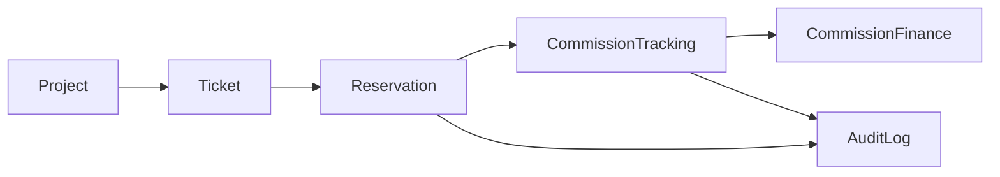
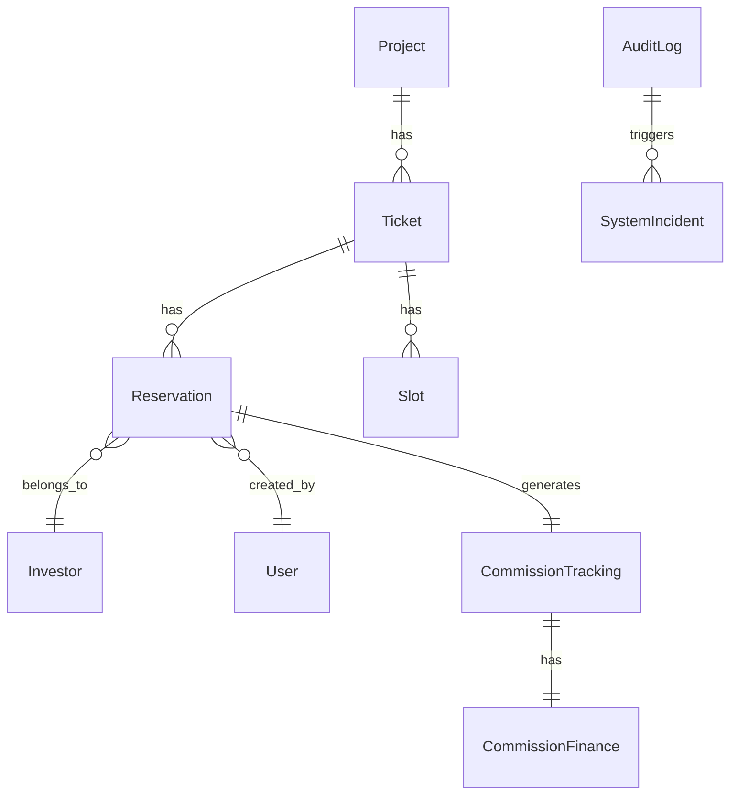
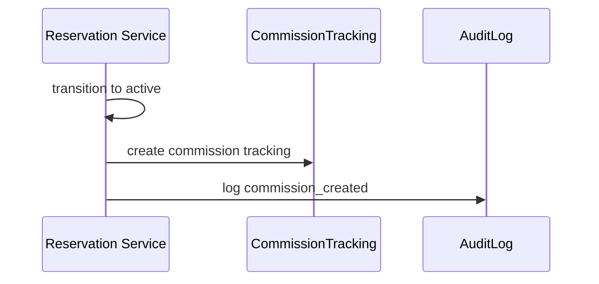
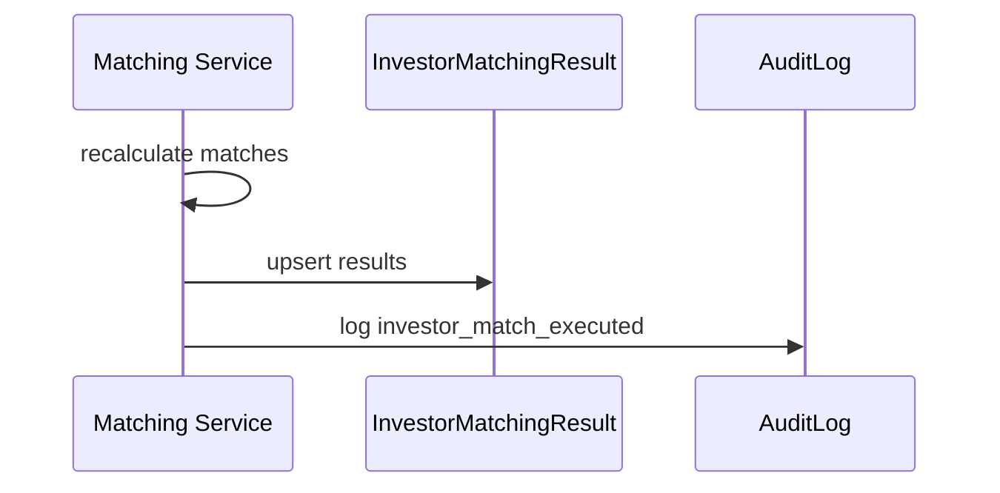
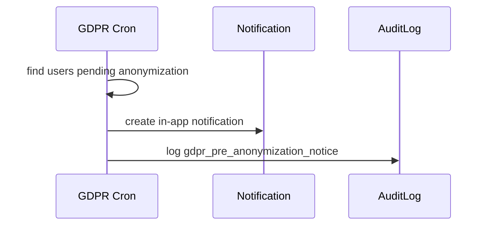
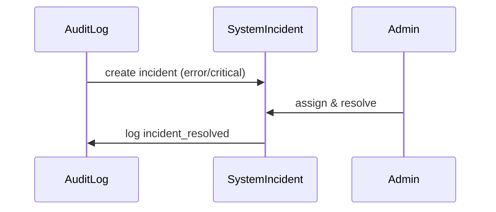

# SystemCore Functional Core Assessment (v3.8.1)

> Účel: konsolidovaná dokumentace pro programátora, která propojuje dostupná data, logiku, governance a UX do jednoho funkčního jádra systému.

## 0) Zdrojová báze a rozsah

Tato dokumentace vychází z manifestu verzí, canonical schema, governance dokumentace, pseudokódu v Appendixu, UX knihovny, Accessibility a GDPR appendixů. Tyto zdroje potvrzují stav systému v rámci SystemCore v3.8.1 a tvoří základ pro návrh plně funkčního jádra. Referenční moduly a jejich stav jsou uvedeny v manifestu a dokumentaci. 【F:systemcore_version_manifest.json†L1-L84】【F:SystemCoreDocumentation.md†L96-L118】

---

## 1) Analýza dat (entity, enumy, vazby)

### 1.1 Canonical entity & vazby (dle schema)

**Primární business entity:**
- **Project** — základ projektu, vazby na Ticket, User (developer), FundAllocation; obsahuje status, investment_form, security_forms a intake workflow. 【F:SystemCoreSchema.ts†L26-L84】
- **Ticket** — investiční nabídka, vazba na Project, Reservation, Slot; obsahuje finanční parametry, security, status a kapacitu. 【F:SystemCoreSchema.ts†L86-L134】
- **Slot** — systémová kapacita pro rezervace, stavový automat a vazba na Reservation. 【F:SystemCoreSchema.ts†L136-L161】
- **Reservation** — lifecycle obchodního procesu, vazby na Investor, Ticket, User (broker) a Commission; obsahuje state machine a e-sign flow. 【F:SystemCoreSchema.ts†L163-L220】

**Provizní a finanční model:**
- **CommissionTracking** — business tracking provize (status, entitlement, deadlines, split); vazba na Reservation, User a CommissionFinance. 【F:SystemCoreSchema.ts†L348-L428】
- **CommissionFinance** — fakturační a účetní data provize (invoice, payment, digital signature). 【F:SystemCoreSchema.ts†L430-L514】

**Uživatelé a klienti:**
- **User** — role-based přístup, admin subrole + permissions, lokalizace, GDPR a retention. 【F:SystemCoreSchema.ts†L516-L578】
- **Investor** — spravovaný brokerem, GDPR anonymizace, retention a lifecycle state. 【F:SystemCoreSchema.ts†L580-L632】
- **Company** — právnická osoba navázaná na investora nebo developera. 【F:SystemCoreSchema.ts†L634-L656】

**Dokumenty, notifikace, audit:**
- **Document** — právní dokumenty napojené na project/reservation/user. 【F:SystemCoreSchema.ts†L658-L689】
- **Notification** — systémové notifikace navázané na uživatele a entity. 【F:SystemCoreSchema.ts†L691-L714】
- **AuditLog** — neměnný auditní záznam se severity, run_id a session_id. 【F:SystemCoreSchema.ts†L716-L753】
- **SystemIncident** — incident management z AuditLog událostí se SLA a workflow. 【F:SystemCoreSchema.ts†L755-L818】
- **AuditLogArchive** — metadata archivace auditních logů včetně checksum a retention. 【F:SystemCoreSchema.ts†L820-L877】

**Matching:**
- **InvestorMatchingResult** — persistentní výsledek matchingu investora a tiketu, včetně validace a quality. 【F:SystemCoreSchema.ts†L2180-L2226】

**Validace & konstanty:**
- **VALIDATION_RULES** — timeouty, limity a tolerance (např. max rezervací na tiket). 【F:SystemCoreSchema.ts†L2230-L2238】
- **TIPAR_PROGRESSION** — pravidla pro broker level a slot capacity. 【F:SystemCoreSchema.ts†L2240-L2283】

### 1.2 Data completeness vs. gaps

**Dostupné a kompletní:**
- Schéma obsahuje kompletní sadu entity + vazby pro klíčový obchodní workflow (Project → Ticket → Slot → Reservation → Commission). 【F:SystemCoreSchema.ts†L26-L514】
- Governance a logika (matching, audit, workflow) jsou popsány v dokumentaci včetně triggers a audit eventů. 【F:SystemCoreDocumentation.md†L121-L233】
- Pseudokód a výpočty pro komise a splitting jsou explicitně uvedeny v Appendixu. 【F:SystemCoreAppendix.tsx†L31-L140】
- GDPR pre-anonymization a accessibility audit pravidla jsou definována v samostatných appendicích. 【F:SystemCoreAppendix_GDPR_PreAnonymization.tsx†L1-L109】【F:SystemCoreAppendix_Accessibility.tsx†L1-L160】

**Chybějící nebo nesoulad:**
- UX komponenty používají pole, která nejsou definována ve schema (např. `Project.target_amount`, `Ticket.amount`, `Ticket.duration_months`, `Ticket.state`). To naznačuje nesoulad datového kontraktu mezi UI a kanonickým modelem. 【F:SystemCoreUXLibrary.tsx†L35-L178】【F:SystemCoreSchema.ts†L35-L134】
- Dokumentace a appendixy nezahrnují konkrétní API kontrakty (request/response), DB schémata nebo migration rules – dostupná je pouze logika a entity. 【F:SystemCoreDocumentation.md†L96-L233】【F:SystemCoreAppendix.tsx†L31-L140】

### 1.3 Lze z dostupných dat postavit plně funkční SystemCore?

**Ano – základní jádro je realizovatelné**, protože máme:
- Canonical entity a vazby pro klíčové workflow (projekty, tikety, rezervace, provize, audit). 【F:SystemCoreSchema.ts†L26-L877】
- Governance pravidla, matching logiku a auditní požadavky. 【F:SystemCoreDocumentation.md†L107-L233】
- Pseudokód a výpočtové postupy pro provize a split. 【F:SystemCoreAppendix.tsx†L31-L140】
- UX reference komponenty, které ukazují očekávaný způsob prezentace dat. 【F:SystemCoreUXLibrary.tsx†L35-L198】

**Ale** je nutné doplnit:
- Specifikaci API kontraktů a integračních endpointů (investor matching API je zmíněno jen v UX). 【F:SystemCoreUXLibrary.tsx†L98-L129】
- Úplnou mapu datových polí mezi UX a schema (např. target_amount vs. canonical finance fields). 【F:SystemCoreUXLibrary.tsx†L58-L178】【F:SystemCoreSchema.ts†L35-L134】
- Databázové migrace a constrainty (unique, indexes, FK) – některé jsou zmíněné v schema, ale nejsou formalizovány jako DB DDL. 【F:SystemCoreSchema.ts†L2180-L2226】

---

## 2) Návrh funkčního jádra a propojení vrstev

### 2.1 Funkční jádro (data + logika + governance + UX)

**Data layer (canonical):**
- Primární data: Project, Ticket, Slot, Reservation, Investor, User, CommissionTracking/Finance. 【F:SystemCoreSchema.ts†L26-L514】
- Auditní data: AuditLog, SystemIncident, AuditLogArchive. 【F:SystemCoreSchema.ts†L716-L877】
- Supporting data: Document, Notification, Company, InvestorMatchingResult. 【F:SystemCoreSchema.ts†L634-L714】【F:SystemCoreSchema.ts†L2180-L2226】

**Logic layer (business rules):**
- Commission creation **pouze** při přechodu Reservation do `active`; entitlement vzniká až po investici. 【F:SystemCoreAppendix.tsx†L35-L71】【F:SystemCoreSchema.ts†L348-L428】
- Investor matching spouštěn na změny investora, tiketu a publikaci projektu; výsledky jsou persistentní. 【F:SystemCoreDocumentation.md†L185-L219】
- GDPR pre-anonymization cron (denně 09:00 CET) – email + in-app notifikace + audit. 【F:SystemCoreAppendix_GDPR_PreAnonymization.tsx†L14-L109】
- Accessibility audit jako automatizovaný check pro WCAG 2.1 AA s audit loggingem. 【F:SystemCoreAppendix_Accessibility.tsx†L11-L124】

**Governance layer:**
- Admin má právo ručně upravit canonical data a opravovat entity (override rights). 【F:SystemCoreDocumentation.md†L107-L118】
- AuditLog je immutable, nese run_id/session_id/severity, incidenty se generují z error/critical. 【F:SystemCoreSchema.ts†L716-L818】

**UX layer:**
- ProjectCard a TicketCard definují očekávaný UI rendering základních dat + matching. 【F:SystemCoreUXLibrary.tsx†L35-L198】

### 2.2 Propojení vrstev – kde se data čtou, zapisují, validují, zobrazují

**Read:**
- UI čte Project/Ticket a matching výsledky (TicketCard loaduje `/api/investor-matching/:ticketId`). 【F:SystemCoreUXLibrary.tsx†L98-L129】
- Admin a compliance dashboard čtou AuditLog, SystemIncident a Validation výsledky (implicitně dané role a audit log schema). 【F:SystemCoreSchema.ts†L716-L818】

**Write:**
- Reservation state transition zapisuje CommissionTracking a AuditLog. 【F:SystemCoreAppendix.tsx†L35-L71】
- GDPR pre-anonymization zapisuje Notification a AuditLog. 【F:SystemCoreAppendix_GDPR_PreAnonymization.tsx†L14-L109】

**Validation:**
- Matching validation a recalculation je řízena triggery a stavy v matching entity. 【F:SystemCoreDocumentation.md†L185-L229】【F:SystemCoreSchema.ts†L2180-L2226】
- Core business limity (max rezervace, timeouty) definované ve VALIDATION_RULES. 【F:SystemCoreSchema.ts†L2230-L2238】

**Display:**
- ProjectCard/TicketCard prezentují klíčové finanční parametry a matching informace. 【F:SystemCoreUXLibrary.tsx†L35-L198】
- UX musí mapovat canonical data fields – aktuálně je zde nesoulad (viz gap analýza). 【F:SystemCoreUXLibrary.tsx†L58-L178】【F:SystemCoreSchema.ts†L35-L134】

---

## 3) Plán vyladění vrstev

### 3.1 Data Layer — kontrola a doplnění
- **Sjednotit datové kontrakty UX ↔ Schema**: např. `Project.target_amount` a `Ticket.amount`/`duration_months` musí být buď doplněny do schema, nebo nahrazeny canonical poli (min_investment_amount, duration, status). 【F:SystemCoreUXLibrary.tsx†L58-L178】【F:SystemCoreSchema.ts†L35-L134】
- **Formalizovat DB constrainty** podle schema: unikátní indexy (InvestorMatchingResult), FK vazby (Reservation → Ticket/Investor/User), retention data. 【F:SystemCoreSchema.ts†L163-L220】【F:SystemCoreSchema.ts†L2180-L2226】
- **Audit data retention**: navázat AuditLogArchive a retention policy na data storage. 【F:SystemCoreSchema.ts†L820-L877】

### 3.2 Logic Layer — centralizace výpočtů a procesů
- **Centralizovat transition logiku rezervací** v jedné službě (včetně provizního triggeru). 【F:SystemCoreAppendix.tsx†L35-L71】
- **Provizní výpočty**: použít canonical výpočet a split validaci (sum = 100%). 【F:SystemCoreAppendix.tsx†L75-L138】
- **Matching**: implementovat event-driven triggry (onInvestorUpdate, onTicketUpdate, onProjectPublish) a persistenci výsledků. 【F:SystemCoreDocumentation.md†L185-L219】
- **A11y audit**: zavést audit helper jako pipeline check v dev/QA a logovat do AuditLog. 【F:SystemCoreAppendix_Accessibility.tsx†L11-L124】

### 3.3 Governance Layer — compliance a audit
- **Admin override**: zakotvit auditované manuální zásahy v admin UI a logovat do AuditLog. 【F:SystemCoreDocumentation.md†L107-L118】【F:SystemCoreSchema.ts†L716-L753】
- **Incident workflow**: spouštět SystemIncident při `error/critical` a řídit SLA. 【F:SystemCoreSchema.ts†L755-L818】
- **Audit archiving**: pravidelně archivovat a ověřovat checksumy. 【F:SystemCoreSchema.ts†L820-L877】

### 3.4 UX Layer — komponenty a napojení na data
- **ProjectCard**: zobrazovat canonical fields (project_type, yield_pa, target amount) a doplnit mapování na schema. 【F:SystemCoreUXLibrary.tsx†L35-L70】【F:SystemCoreSchema.ts†L35-L84】
- **TicketCard**: sjednotit field names (min_investment_amount, duration, status). 【F:SystemCoreUXLibrary.tsx†L98-L178】【F:SystemCoreSchema.ts†L96-L134】
- **Investor matching UI**: zachovat API load `/api/investor-matching/:ticketId` a mapovat na InvestorMatchingResult. 【F:SystemCoreUXLibrary.tsx†L98-L129】【F:SystemCoreSchema.ts†L2180-L2226】

### 3.5 Automation Layer — cron procesy a validace
- **GDPR pre-anonymization cron** denně 09:00 CET (email + in-app + audit). 【F:SystemCoreAppendix_GDPR_PreAnonymization.tsx†L14-L109】
- **Matching validation cron** (implicitní z entity a auditních metrik) – ověřovat active matches. 【F:SystemCoreSchema.ts†L2180-L2226】
- **Audit log archive cron** – vytvořit AuditLogArchive běhy a purge. 【F:SystemCoreSchema.ts†L820-L877】
- **Accessibility audit** jako pravidelný QA check. 【F:SystemCoreAppendix_Accessibility.tsx†L11-L124】

---

## 4) Finální dokumentace pro programátora (moduly)

### Modul: Project & Ticket Management
- **Účel / Popis:** správa investičních projektů a tiketů včetně intake workflow a security. 【F:SystemCoreSchema.ts†L26-L134】
- **Vstupní data:** Project, Ticket, FundAllocation, SecurityType, user (developer/broker). 【F:SystemCoreSchema.ts†L26-L134】
- **Výstupní data:** publikované projekty, dostupné tikety, slot capacity. 【F:SystemCoreSchema.ts†L86-L161】
- **Logické závislosti:** matching používá ticket/project data; rezervace používá ticket + slot. 【F:SystemCoreDocumentation.md†L222-L229】【F:SystemCoreSchema.ts†L136-L220】
- **Rizika / Doporučení:** sjednotit UI field mapping (target_amount vs canonical). 【F:SystemCoreUXLibrary.tsx†L58-L178】【F:SystemCoreSchema.ts†L35-L134】

### Modul: Reservation Lifecycle & E-Sign
- **Účel / Popis:** řízení state machine rezervací, e-sign a aktivace obchodu. 【F:SystemCoreSchema.ts†L163-L220】
- **Vstupní data:** Reservation, Ticket, Slot, Investor, User (broker). 【F:SystemCoreSchema.ts†L163-L220】
- **Výstupní data:** aktivní rezervace, auditní eventy, trigger pro provize. 【F:SystemCoreAppendix.tsx†L35-L71】
- **Logické závislosti:** provize vzniká pouze při `reservation_state = active`. 【F:SystemCoreAppendix.tsx†L35-L71】
- **Rizika / Doporučení:** centralizovat transition handler, auditovat každý přechod. 【F:SystemCoreAppendix.tsx†L35-L71】

### Modul: Commission Tracking & Finance
- **Účel / Popis:** rozdělení provizí na tracking + finance, s billing a payout lifecycle. 【F:SystemCoreSchema.ts†L348-L514】
- **Vstupní data:** Reservation, Ticket (commission percent), CommissionSplitRule. 【F:SystemCoreSchema.ts†L348-L406】
- **Výstupní data:** CommissionTracking statusy, invoice metadata, payment tracking. 【F:SystemCoreSchema.ts†L370-L514】
- **Logické závislosti:** provizní výpočet + split rules (sum = 100%). 【F:SystemCoreAppendix.tsx†L75-L138】
- **Rizika / Doporučení:** hlídat entitlement timing (až po investici) a auditovat status změny. 【F:SystemCoreSchema.ts†L360-L423】

### Modul: Investor Management & Matching
- **Účel / Popis:** registrace investorů brokerem, automatizovaný matching s tikety. 【F:SystemCoreDocumentation.md†L121-L229】
- **Vstupní data:** Investor, InvestorPreferences, Ticket, Project. 【F:SystemCoreDocumentation.md†L224-L229】【F:SystemCoreSchema.ts†L580-L632】
- **Výstupní data:** InvestorMatchingResult s match_score a quality, auditní eventy. 【F:SystemCoreSchema.ts†L2180-L2226】
- **Logické závislosti:** triggry onInvestorUpdate/onTicketUpdate/onProjectPublish. 【F:SystemCoreDocumentation.md†L185-L193】
- **Rizika / Doporučení:** zajistit persistenci výsledků a indexy pro výkon. 【F:SystemCoreSchema.ts†L2180-L2226】

### Modul: Audit & Incident Management
- **Účel / Popis:** auditní trail všech klíčových změn a incident management ze severity eventů. 【F:SystemCoreSchema.ts†L716-L818】
- **Vstupní data:** AuditLog (action, entity_id, run_id), SystemIncident metadata. 【F:SystemCoreSchema.ts†L716-L818】
- **Výstupní data:** incidenty se SLA a historické archivy auditů. 【F:SystemCoreSchema.ts†L755-L877】
- **Logické závislosti:** governance pravidla a admin override. 【F:SystemCoreDocumentation.md†L107-L118】
- **Rizika / Doporučení:** audit log musí být immutable, archivace s checksumem. 【F:SystemCoreSchema.ts†L716-L877】

### Modul: GDPR Lifecycle (Retention + Pre-anonymization)
- **Účel / Popis:** správa lifecycle a anonymizace investorů/brokerů, pre-notice 7 dní předem. 【F:SystemCoreSchema.ts†L552-L632】【F:SystemCoreAppendix_GDPR_PreAnonymization.tsx†L1-L109】
- **Vstupní data:** data_retention_until, state=archived, anonymized_at. 【F:SystemCoreSchema.ts†L552-L632】
- **Výstupní data:** notifikace + auditní záznamy. 【F:SystemCoreAppendix_GDPR_PreAnonymization.tsx†L14-L109】
- **Logické závislosti:** Notification entity, AuditLog. 【F:SystemCoreSchema.ts†L691-L753】
- **Rizika / Doporučení:** synchronizace retention policy s účetními požadavky. 【F:SystemCoreSchema.ts†L615-L618】

### Modul: Accessibility Compliance
- **Účel / Popis:** WCAG 2.1 AA audit helper a logování compliance. 【F:SystemCoreAppendix_Accessibility.tsx†L1-L124】
- **Vstupní data:** DOM metriky (ARIA, focus, semantic). 【F:SystemCoreAppendix_Accessibility.tsx†L26-L100】
- **Výstupní data:** auditní report + score + AuditLog event. 【F:SystemCoreAppendix_Accessibility.tsx†L102-L124】
- **Logické závislosti:** AuditLog dostupný v runtime. 【F:SystemCoreAppendix_Accessibility.tsx†L116-L124】
- **Rizika / Doporučení:** spouštět jako QA/CI check, ne v produkci bez rate limitu. 【F:SystemCoreAppendix_Accessibility.tsx†L11-L19】

### Modul: UX Integration
- **Účel / Popis:** napojení UI komponent na canonical data + matching API. 【F:SystemCoreUXLibrary.tsx†L35-L198】
- **Vstupní data:** Project, Ticket, matching investors. 【F:SystemCoreUXLibrary.tsx†L35-L129】
- **Výstupní data:** vizualizace projektu, tiketu a matchingu. 【F:SystemCoreUXLibrary.tsx†L58-L198】
- **Logické závislosti:** data mapping ze schema + matching endpoint. 【F:SystemCoreUXLibrary.tsx†L98-L129】【F:SystemCoreSchema.ts†L96-L134】
- **Rizika / Doporučení:** odstranit field mismatches a sjednotit naming. 【F:SystemCoreUXLibrary.tsx†L58-L178】【F:SystemCoreSchema.ts†L96-L134】

---

## 5) Návrh konsolidace dat a logiky (řešení gapů)

### 5.1 Gap 1 — UX ↔ Schema field mismatch
**Zjištění:** UI komponenty očekávají `Project.target_amount`, `Ticket.amount`, `Ticket.duration_months`, `Ticket.state`, zatímco schema používá `min_investment_amount`, `duration` a `status`. 【F:SystemCoreUXLibrary.tsx†L58-L178】【F:SystemCoreSchema.ts†L35-L134】  
**Návrh řešení (logicky, bez kódu):**
- **Canonical mapping layer** mezi UI a schema.  
  - UI `Project.target_amount` mapovat na canonical finanční pole (doporučeno **doplnit do schema** jako `target_amount` nebo mapovat na existující field v Project, pokud je definován v interním DB modelu).  
  - UI `Ticket.amount` → schema `min_investment_amount`.  
  - UI `Ticket.duration_months` → schema `duration`.  
  - UI `Ticket.state` → schema `status`.  
- **Rozhodnutí:** buď rozšířit schema (přidat `target_amount` a aliasy), nebo upravit UX tak, aby používal canonical naming.  
- **Dopad:**  
  - **Data layer:** buď doplnění `target_amount` v Project, nebo explicitní mapping v API layer.  
  - **Logic layer:** žádná změna výpočtů, pouze mapping.  
  - **UX layer:** úprava bindingu fieldů.  
  - **Governance layer:** audit eventy zůstávají, ale logované field names musí odpovídat canonicalu.  

### 5.2 Gap 2 — Chybějící API kontrakty
**Zjištění:** Dokumentace i schema popisují entity a logiku, ale chybí explicitní API request/response kontrakty. 【F:SystemCoreDocumentation.md†L96-L233】  
**Návrh řešení (logicky):**
- Definovat API vrstvy podle lifecycle modulů:  
  - **Project/Ticket API** (CRUD + publish/close actions).  
  - **Reservation API** (create, transition state, e-sign updates).  
  - **Commission API** (read tracking/finance, admin confirm).  
  - **Investor Matching API** (`/investor-matching/:ticketId`, batch recalculation). 【F:SystemCoreUXLibrary.tsx†L98-L129】  
  - **Audit/Incident API** (read-only log viewer, incident assign/resolve). 【F:SystemCoreSchema.ts†L716-L818】  
  - **GDPR API** (retention updates, anonymize trigger). 【F:SystemCoreSchema.ts†L552-L632】  
- **Kontrakty mají být explicitní v dokumentaci**: pro každý endpoint definovat vstupní data (required/optional), výstupní data (entity + metadata), errors, audit event.  
- **Dopad:**  
  - **Logic layer:** centralizace validation + state transitions.  
  - **UX layer:** zjednodušené mapování dat bez implicitních fieldů.  
  - **Governance layer:** audit trail musí mapovat všechny write operace.  

### 5.3 Gap 3 — Chybějící DB constrainty a integrity pravidla
**Zjištění:** Schema zmiňuje indexy a vazby, ale nejsou formalizovány jako DB constrainty. 【F:SystemCoreSchema.ts†L2180-L2226】  
**Návrh řešení (logicky):**
- **Foreign keys** pro všechny entity vazby (Reservation → Ticket/Investor/User, CommissionTracking → Reservation, CommissionFinance → CommissionTracking). 【F:SystemCoreSchema.ts†L163-L514】  
- **Unique constraints**:  
  - InvestorMatchingResult (investor_id, ticket_id) unique. 【F:SystemCoreSchema.ts†L2180-L2226】  
- **Check constraints / business rules:**  
  - max reservations per ticket (3) dle VALIDATION_RULES. 【F:SystemCoreSchema.ts†L2230-L2238】  
  - commission split sum = 100. 【F:SystemCoreAppendix.tsx†L101-L138】  
- **Dopad:**  
  - **Data layer:** integrity enforced on persistence.  
  - **Logic layer:** must handle constraint violations with audit logs.  
  - **Governance layer:** invalid operations must create AuditLog events.  

---

## 6) Finální vývojářská dokumentace — konsolidovaný návrh

### 6.1 Modul: Data Layer (Canonical Data Contracts)
**Popis:** jediný zdroj pravdy pro Project, Ticket, Reservation, CommissionTracking/Finance, Investor, AuditLog. 【F:SystemCoreSchema.ts†L26-L877】  
**Datové kontrakty (logicky):**
- **Project**: `id`, `name`, `location`, `project_type`, `yield_pa`, `duration`, `investment_form`, `security_forms`, `use_of_funds`, `status`, `target_amount?` (pokud doplněno). 【F:SystemCoreSchema.ts†L35-L84】  
- **Ticket**: `id`, `project_id`, `min_investment_amount`, `expected_yield_percent`, `commission`, `ltv`, `duration`, `status`, `forms_of_security?`, `security_required?`. 【F:SystemCoreSchema.ts†L96-L134】  
- **Reservation**: `id`, `reservation_state`, `investor_id`, `ticket_id`, `slot_id`, `broker_id`, `commission_id`, e-sign fields. 【F:SystemCoreSchema.ts†L163-L220】  
- **CommissionTracking/Finance**: split logic + billing metadata. 【F:SystemCoreSchema.ts†L348-L514】  
- **AuditLog/SystemIncident**: immutable logs + incident workflow. 【F:SystemCoreSchema.ts†L716-L818】  

### 6.2 Modul: Logic Layer (Business Rules)
**Popis:** centralizované procesy (reservation state, matching, commission).  
**Klíčové pravidlo:** commission tracking vzniká pouze při `reservation_state = active`. 【F:SystemCoreAppendix.tsx†L35-L71】  
**Validation rules:** timeouts, max reservations, commission split sum = 100. 【F:SystemCoreSchema.ts†L2230-L2238】【F:SystemCoreAppendix.tsx†L101-L138】  

### 6.3 Modul: Governance Layer (Audit & Compliance)
**Popis:** audit trail + incident management + GDPR governance.  
**Audit pravidla:** AuditLog je immutable, severity generuje SystemIncident, run_id/session_id je povinný pro batch procesy. 【F:SystemCoreSchema.ts†L716-L818】  
**GDPR:** retention + pre-anonymization cron; audit eventy pro notifikace. 【F:SystemCoreAppendix_GDPR_PreAnonymization.tsx†L14-L109】  

### 6.4 Modul: UX Layer (Data Binding)
**Popis:** UI musí používat canonical naming a mapping.  
**Kontrakty:** ProjectCard, TicketCard, Matching modal. 【F:SystemCoreUXLibrary.tsx†L35-L198】  
**Povinné mapování:** `Ticket.amount` → `min_investment_amount`, `Ticket.duration_months` → `duration`, `Ticket.state` → `status`. 【F:SystemCoreUXLibrary.tsx†L98-L178】【F:SystemCoreSchema.ts†L96-L134】  

---

## 7) Návrh API kontraktů (request/response)

> Pozn.: kontrakty jsou uvedeny logicky, bez kódu.

### 7.1 Project API
- **GET /projects** → seznam Project[] (filtered by status).  
- **POST /projects** → vytvoření Project (audit `project_created`).  
- **PATCH /projects/:id** → update Project (audit `project_updated`).  
- **POST /projects/:id/publish** → publish workflow (audit `project_published`).  

### 7.2 Ticket API
- **GET /tickets?project_id=** → Ticket[] pro projekt.  
- **POST /tickets** → vytvoření Ticket (audit `ticket_created`).  
- **PATCH /tickets/:id** → update Ticket (audit `ticket_updated`).  

### 7.3 Reservation API
- **POST /reservations** → vytvoření Reservation (audit `reservation_created`).  
- **POST /reservations/:id/transition** → změna state (audit `reservation_state_changed`, trigger commission).  
- **POST /reservations/:id/esign** → update e-sign metadata.  

### 7.4 Commission API
- **GET /commissions/:id** → CommissionTracking + CommissionFinance.  
- **POST /commissions/:id/confirm** → admin confirms, audit `commission_confirmed`.  

### 7.5 Investor Matching API
- **GET /investor-matching/:ticketId** → InvestorMatch[] pro TicketCard. 【F:SystemCoreUXLibrary.tsx†L98-L129】  
- **POST /investor-matching/recalculate** → batch recalculation (audit `investor_match_executed`).  

### 7.6 Audit/Incident API
- **GET /audit-logs** → AuditLog[] (read-only).  
- **GET /incidents** → SystemIncident[] (workflow view).  
- **POST /incidents/:id/resolve** → status update (audit `incident_resolved`).  

### 7.7 GDPR API
- **POST /gdpr/anonymize** → anonymization trigger (audit `investor_anonymized`/`broker_anonymized`).  
- **POST /gdpr/retention** → update retention dates.  

---

## 8) Validace a DB constrainty

**Constrainty (DB):**
- FK: Reservation → Ticket/Investor/User; CommissionTracking → Reservation; CommissionFinance → CommissionTracking. 【F:SystemCoreSchema.ts†L163-L514】  
- Unique: InvestorMatchingResult (investor_id, ticket_id). 【F:SystemCoreSchema.ts†L2180-L2226】  
- Limits: max reservations per ticket = 3. 【F:SystemCoreSchema.ts†L2230-L2238】  
- Commission split sum must equal 100%. 【F:SystemCoreAppendix.tsx†L101-L138】  

**Validace (logic layer):**
- Reservation state transition guard + e-sign completion rules. 【F:SystemCoreSchema.ts†L163-L220】  
- Matching recalculation only when investor/ticket/project changes. 【F:SystemCoreDocumentation.md†L185-L193】  
- GDPR retention triggers with audit logs. 【F:SystemCoreAppendix_GDPR_PreAnonymization.tsx†L14-L109】  

---

## 9) Auditní a cron procesy

- **GDPR Pre-Anonymization cron**: denně 09:00 CET. 【F:SystemCoreAppendix_GDPR_PreAnonymization.tsx†L14-L109】  
- **AuditLog Archive cron**: export + purge + checksum validation. 【F:SystemCoreSchema.ts†L820-L877】  
- **Investor Matching validation cron**: revalidate `InvestorMatchingResult`. 【F:SystemCoreSchema.ts†L2180-L2226】  
- **Accessibility audit**: QA check + AuditLog. 【F:SystemCoreAppendix_Accessibility.tsx†L11-L124】  

---

## 10) Pořadí implementace (závislosti)

1. **Data layer**: sjednotit schema + DB constrainty (FK, unique, limits).  
2. **Logic layer**: centralizované state transitions + commission logic.  
3. **API layer**: definovat CRUD + transition endpoints, mapping contracts.  
4. **UX layer**: opravit field mapping podle canonical schema.  
5. **Governance/Automation**: audit logs, incident workflow, cron jobs.  

---

## 11) Závěrečné hodnocení dostupnosti dat

**Dostatek dat pro návrh funkčního jádra:** Ano, schema + governance + appendixy poskytují logiku, entity a auditní rámec. 【F:SystemCoreSchema.ts†L26-L877】【F:SystemCoreDocumentation.md†L107-L233】【F:SystemCoreAppendix.tsx†L31-L140】  
**Nutné doplnění pro implementaci:** explicitní API kontrakty a DB schema, plus sjednocení UI field mappingu. 【F:SystemCoreDocumentation.md†L96-L233】【F:SystemCoreUXLibrary.tsx†L58-L178】  

---

## 12) Implementační roadmapa (SystemCore v3.8.1)

### 12.1 Fáze: Datová vrstva (DB schema, constrainty, migrace)
- **Cíl implementace:** formalizovat entity, FK/unique/check constrainty a migrační plán. 【F:SystemCoreSchema.ts†L26-L877】  
- **Závislosti:** canonical schema a validace pravidel (VALIDATION_RULES, matching indexes). 【F:SystemCoreSchema.ts†L2180-L2238】  
- **Odhad dopadu:**  
  - **Data:** vysoký (nové constrainty, indexy, migrations).  
  - **Logic/UX/Governance:** nepřímý (constraint violations budou propagovány).  
- **Očekávané výstupy:**  
  - DB migrace pro FK/unique/check.  
  - Dokument DB constraintů (např. InvestorMatchingResult unique). 【F:SystemCoreSchema.ts†L2180-L2226】  
- **Testovací metody:**  
  - DB migration testy, constraint unit tests, integrity check job.  

### 12.2 Fáze: Logická vrstva (business services, procesy, validace)
- **Cíl implementace:** centralizovat state transitions, matching logiku, commission lifecycle, SLA policy. 【F:SystemCoreAppendix.tsx†L35-L138】【F:SystemCoreDocumentation.md†L185-L219】  
- **Závislosti:** DB schema stabilní, constrainty aktivní.  
- **Odhad dopadu:**  
  - **Logic:** vysoký (state machine, triggers).  
  - **Data:** střední (nové write flows).  
  - **Governance:** vysoký (audit log).  
- **Očekávané výstupy:**  
  - Reservation transition handler (single source).  
  - Commission tracking lifecycle (entitlement rules). 【F:SystemCoreSchema.ts†L348-L428】  
  - Matching recalculation triggers. 【F:SystemCoreDocumentation.md†L185-L193】  
- **Testovací metody:**  
  - Unit testy pro transitions a kalkulace.  
  - Integration testy pro matching a provize.  
  - Audit trail validation.  

### 12.3 Fáze: API kontrakty (endpointy, request/response modely)
- **Cíl implementace:** definovat jednotný API surface pro CRUD + workflow operace. 【F:SystemCoreUXLibrary.tsx†L98-L129】  
- **Závislosti:** logická vrstva a canonical mapping.  
- **Odhad dopadu:**  
  - **API:** vysoký (kontrakty a verze).  
  - **UX:** střední (data binding).  
  - **Governance:** střední (audit events on write).  
- **Očekávané výstupy:**  
  - Specifikace endpointů včetně audit eventů.  
  - Request/response modely pro Project/Ticket/Reservation/Commission/Matching/Audit/GDPR.  
- **Testovací metody:**  
  - Contract tests (schema validation).  
  - Integration tests s DB a audit logy.  

### 12.4 Fáze: UX integrace (frontend mapování dat)
- **Cíl implementace:** sjednotit field mapping mezi UX a schema. 【F:SystemCoreUXLibrary.tsx†L58-L178】  
- **Závislosti:** API kontrakty stabilní.  
- **Odhad dopadu:**  
  - **UX:** vysoký (binding a zobrazování).  
  - **Data/Logic:** nízký (jen mapping).  
- **Očekávané výstupy:**  
  - Aktualizované data contracts pro ProjectCard/TicketCard.  
  - Konsistentní naming (min_investment_amount, duration, status). 【F:SystemCoreSchema.ts†L96-L134】  
- **Testovací metody:**  
  - UI snapshot testy.  
  - QA testy pro data binding + matching modal.  

### 12.5 Fáze: Governance & audit (RBA, auditní eventy)
- **Cíl implementace:** zajistit audit trail, incident workflow a RBA/RBAC enforcement. 【F:SystemCoreSchema.ts†L516-L578】【F:SystemCoreSchema.ts†L716-L818】  
- **Závislosti:** API/logic layer (audit eventy generované při akcích) + role/permissions model. 【F:SystemCoreSchema.ts†L516-L578】  
- **Odhad dopadu:**  
  - **Governance:** vysoký (compliance, RBAC enforcement).  
  - **Data/Logic:** střední (AuditLog writes, permission checks).  
- **Očekávané výstupy:**  
  - Audit event map a incident triggers.  
  - Admin override workflows. 【F:SystemCoreDocumentation.md†L107-L118】  
  - RBA/RBAC pravidla pro admin subrole + permissions. 【F:SystemCoreSchema.ts†L516-L578】  
- **Testovací metody:**  
  - Audit validation testy.  
  - Permission/RBA testy (role vs. action).  
  - SLA/incident workflow tests.  

### 12.6 Fáze: Automatizace (cron, SLA, anonymizace)
- **Cíl implementace:** provozní soběstačnost (cron jobs, SLA, GDPR). 【F:SystemCoreAppendix_GDPR_PreAnonymization.tsx†L14-L109】  
- **Závislosti:** AuditLog, Notification, GDPR fields. 【F:SystemCoreSchema.ts†L552-L714】  
- **Odhad dopadu:**  
  - **Automation:** vysoký.  
  - **Governance:** vysoký (audit logs, compliance).  
- **Očekávané výstupy:**  
  - GDPR pre-anonymization cron.  
  - AuditLog archive cron + checksum validation. 【F:SystemCoreSchema.ts†L820-L877】  
  - Matching validation cron. 【F:SystemCoreSchema.ts†L2180-L2226】  
- **Testovací metody:**  
  - Cron dry-run tests.  
  - Audit log verification for automation events.  

---

## 13) Struktura API a datových endpointů (návrh)

### 13.1 `/api/projects`
- **Účel:** CRUD nad Project + publish workflow.  
- **Metody:** GET, POST, PATCH, POST `/publish`.  
- **Datový model:** Project (canonical fields + optional target_amount). 【F:SystemCoreSchema.ts†L35-L84】  

### 13.2 `/api/tickets`
- **Účel:** CRUD tikety a listing podle projektu.  
- **Metody:** GET, POST, PATCH.  
- **Datový model:** Ticket (min_investment_amount, duration, status). 【F:SystemCoreSchema.ts†L96-L134】  

### 13.3 `/api/reservations`
- **Účel:** vytváření a state transitions.  
- **Metody:** POST (create), POST `/transition`, POST `/esign`.  
- **Datový model:** Reservation + e-sign fields. 【F:SystemCoreSchema.ts†L163-L220】  

### 13.4 `/api/commissions`
- **Účel:** čtení tracking/finance a potvrzení adminem.  
- **Metody:** GET `/:id`, POST `/:id/confirm`.  
- **Datový model:** CommissionTracking + CommissionFinance. 【F:SystemCoreSchema.ts†L348-L514】  

### 13.5 `/api/matching`
- **Účel:** matching investorů k tiketům.  
- **Metody:** GET `/:ticketId`, POST `/recalculate`.  
- **Datový model:** InvestorMatchingResult + InvestorMatch view. 【F:SystemCoreSchema.ts†L2180-L2226】  

### 13.6 `/api/audit`
- **Účel:** auditní logy a incidenty (read-only + resolve).  
- **Metody:** GET `/logs`, GET `/incidents`, POST `/incidents/:id/resolve`.  
- **Datový model:** AuditLog + SystemIncident. 【F:SystemCoreSchema.ts†L716-L818】  

### 13.7 `/api/gdpr`
- **Účel:** retention + anonymizace.  
- **Metody:** POST `/retention`, POST `/anonymize`.  
- **Datový model:** User/Investor GDPR fields. 【F:SystemCoreSchema.ts†L552-L632】  

---

## 14) Testování vrstev

- **Data layer:** migration tests, constraint checks, integrity audits.  
- **Logic layer:** unit testy pro transitions, matching a provize.  
- **API layer:** contract tests, integration tests s DB.  
- **UX layer:** snapshot + QA testy pro mapping a matching UI.  
- **Governance:** audit log validation, incident workflow tests.  
- **Automation:** cron dry-run testy + audit verification.  

---

## 15) Implementation Order (kritická posloupnost)

1. **Data layer** — schema + constrainty + migrations.  
2. **Logic layer** — centralizované business procesy a validace.  
3. **API kontrakty** — endpointy + request/response modely.  
4. **UX integrace** — mapping fieldů a UI binding.  
5. **Governance & audit** — audit events + incident workflow.  
6. **Automation** — cron jobs, SLA, GDPR procesy.  

---

## 16) Shrnutí očekávaného výsledku

Po dokončení roadmapy bude SystemCore plně konzistentní napříč daty, logikou, UX a governance, s definovaným API a auditním rámcem. 【F:SystemCoreSchema.ts†L26-L877】  
**Automaticky validovatelné oblasti:** audit trail, SLA/incident workflow, GDPR retenční procesy, matching validation. 【F:SystemCoreSchema.ts†L716-L877】【F:SystemCoreAppendix_GDPR_PreAnonymization.tsx†L14-L109】  

---

## 17) Implementation Blueprint (detailní návrh)

### 17.1 Data Flow Diagram (DFD)
**Název diagramu:** DFD — Project → Ticket → Reservation → Commission → Audit  
**Popis:** Zobrazuje tok dat od vytvoření projektu přes tiket a rezervaci až po vznik provize a auditní logy.  
**Účastnící se moduly:** Project, Ticket, Reservation, CommissionTracking/Finance, AuditLog. 【F:SystemCoreSchema.ts†L26-L753】  
**Klíčové události:**  
- Project publish → Ticket availability  
- Reservation state transition → CommissionTracking creation  
- AuditLog zápis pro každý state change  
**Audit/SLA checkpoints:** AuditLog immutable, incident trigger při severity error/critical. 【F:SystemCoreSchema.ts†L716-L818】  
**Rizika a poznámky:** riziko nekonzistence bez centralizovaného transition handleru.  



---

### 17.2 Entity Relationship Diagram (ERD)
**Název diagramu:** ERD — Core entities  
**Popis:** Entity a vazby dle SystemCoreSchema.ts.  
**Účastnící se moduly:** Project, Ticket, Slot, Reservation, Investor, User, CommissionTracking, CommissionFinance, AuditLog, SystemIncident. 【F:SystemCoreSchema.ts†L26-L818】  
**Klíčové validační body:** FK vazby a unique constrainty (InvestorMatchingResult). 【F:SystemCoreSchema.ts†L163-L2226】  
**Audit/SLA checkpoints:** AuditLog → SystemIncident vazba. 【F:SystemCoreSchema.ts†L716-L818】  
**Rizika a poznámky:** bez FK hrozí orphan records.  



---

### 17.3 API Endpoint Map
**Název diagramu:** API Endpoint Map — core endpoints  
**Popis:** Přehled endpointů, účelu a vazeb na entity.  
**Účastnící se moduly:** API layer + entity model. 【F:SystemCoreSchema.ts†L26-L877】  
**Klíčové validační body:** request/response kontrakty, audit eventy.  
**Audit/SLA checkpoints:** všechny write operace logují AuditLog. 【F:SystemCoreSchema.ts†L716-L753】  
**Rizika a poznámky:** bez explicitních kontraktů hrozí UX/schema mismatch.  

| Endpoint | Účel | Metody | Datový model |
|---|---|---|---|
| `/api/projects` | CRUD + publish | GET/POST/PATCH/POST publish | Project【F:SystemCoreSchema.ts†L35-L84】 |
| `/api/tickets` | CRUD + list | GET/POST/PATCH | Ticket【F:SystemCoreSchema.ts†L96-L134】 |
| `/api/reservations` | create/transition/esign | POST/POST transition/POST esign | Reservation【F:SystemCoreSchema.ts†L163-L220】 |
| `/api/commissions` | read/confirm | GET/POST confirm | CommissionTracking/Finance【F:SystemCoreSchema.ts†L348-L514】 |
| `/api/matching` | matching results | GET/POST recalc | InvestorMatchingResult【F:SystemCoreSchema.ts†L2180-L2226】 |
| `/api/audit` | logs/incidents | GET logs/GET incidents/POST resolve | AuditLog/SystemIncident【F:SystemCoreSchema.ts†L716-L818】 |
| `/api/gdpr` | retention/anonymize | POST retention/POST anonymize | User/Investor GDPR fields【F:SystemCoreSchema.ts†L552-L632】 |

---

### 17.4 Sequence Diagram — Reservation → Commission
**Popis:** Rezervace přejde do `active`, systém založí CommissionTracking.  
**Účastníci:** Reservation service, CommissionTracking, AuditLog. 【F:SystemCoreAppendix.tsx†L35-L71】  
**Klíčové události:** transition, commission creation, audit log.  
**Audit/SLA checkpoints:** AuditLog záznam s eventem commission_created. 【F:SystemCoreAppendix.tsx†L35-L71】  
**Rizika:** pokud transition proběhne mimo central handler, hrozí missing commission.  



---

### 17.5 Sequence Diagram — Investor Matching
**Popis:** Trigger z investor/ticket update spustí matching a uloží výsledky.  
**Účastníci:** Matching service, InvestorMatchingResult, AuditLog. 【F:SystemCoreDocumentation.md†L185-L219】【F:SystemCoreSchema.ts†L2180-L2226】  
**Klíčové události:** recalculation, persistence, audit event.  
**Audit/SLA checkpoints:** audit run_id, validation_run_id. 【F:SystemCoreSchema.ts†L2180-L2226】  
**Rizika:** neaktualizované matches při chybě triggeru.  



---

### 17.6 Sequence Diagram — GDPR Pre-anonymizace
**Popis:** Denní cron hledá archived uživatele a posílá notifikace.  
**Účastníci:** Cron job, Notification, AuditLog. 【F:SystemCoreAppendix_GDPR_PreAnonymization.tsx†L14-L109】  
**Klíčové události:** select users, send email, create notification, audit log.  
**Audit/SLA checkpoints:** `gdpr_pre_anonymization_notice` event. 【F:SystemCoreAppendix_GDPR_PreAnonymization.tsx†L80-L109】  
**Rizika:** chybějící retention date nebo mail failure.  



---

### 17.7 Sequence Diagram — Audit Incident Workflow
**Popis:** AuditLog severity error/critical automaticky vytváří SystemIncident.  
**Účastníci:** AuditLog, SystemIncident, Admin. 【F:SystemCoreSchema.ts†L716-L818】  
**Klíčové události:** audit event, incident creation, assignment, resolution.  
**Audit/SLA checkpoints:** SLA deadline + breach flag. 【F:SystemCoreSchema.ts†L802-L806】  
**Rizika:** neuzavřený incident může porušit SLA.  



---

## 18) Datové toky podle vrstev

### 18.1 Data Layer (DB IO)
**Popis:** persistence všech canonical entit + integrity constraints.  
**Vstupy/Výstupy:** CRUD entity data, constraint validations.  
**Audit/SLA:** AuditLog, SystemIncident. 【F:SystemCoreSchema.ts†L716-L818】  

### 18.2 Logic Layer (services/triggery)
**Popis:** state transitions, matching, commission logic.  
**Vstupy/Výstupy:** Reservation transitions, CommissionTracking creation, Matching results. 【F:SystemCoreAppendix.tsx†L35-L71】【F:SystemCoreDocumentation.md†L185-L219】  
**Audit/SLA:** audit run_id, matching validation. 【F:SystemCoreSchema.ts†L2180-L2226】  

### 18.3 API Layer (endpointy/contracts)
**Popis:** exposes CRUD + workflow endpoints pro UX a admin.  
**Vstupy/Výstupy:** request/response modely dle canonical entity.  
**Audit/SLA:** audit eventy na write operace. 【F:SystemCoreSchema.ts†L716-L753】  

### 18.4 UX Layer (komponenty/calls)
**Popis:** ProjectCard/TicketCard + matching modal.  
**Vstupy/Výstupy:** data binding z API kontraktů, mapování canonical fields. 【F:SystemCoreUXLibrary.tsx†L35-L198】  
**Audit/SLA:** read-only; write actions přes API.  

### 18.5 Governance Layer (audit logy/RBA)
**Popis:** RBA/RBAC enforcement, audit trail, incident workflow.  
**Vstupy/Výstupy:** role/permissions, audit events. 【F:SystemCoreSchema.ts†L516-L818】  
**Audit/SLA:** incident SLA deadlines, audit retention. 【F:SystemCoreSchema.ts†L802-L877】  

---

## 19) Integration Plan (SystemCore v3.8.1)

### 19.1 Data Layer
**Účel:** stabilní persistence canonical entit a enforce constraintů.  
**Datové vazby:** Project → Ticket → Reservation → CommissionTracking/Finance → AuditLog. 【F:SystemCoreSchema.ts†L26-L877】  
**Endpointy:** napojené přes API layer (CRUD + workflow).  
**Storage/DB:** relational storage s FK/unique/check constrainty. 【F:SystemCoreSchema.ts†L163-L2238】  
**Testovací a auditní body:** migration/constraint tests, integrity audits.  
**Monitoring:** AuditLog + SystemIncident na porušení integrity. 【F:SystemCoreSchema.ts†L716-L818】  
**Rizika a doporučení:** bez FK/unique hrozí orphan records a duplicity (matching).  

### 19.2 Logic Layer
**Účel:** centralizace business procesů (reservation transitions, commission lifecycle, matching).  
**Datové vazby:** Reservation state → CommissionTracking create; Ticket/Investor update → matching. 【F:SystemCoreAppendix.tsx†L35-L71】【F:SystemCoreDocumentation.md†L185-L219】  
**Endpointy:** `/api/reservations`, `/api/commissions`, `/api/matching`.  
**Storage/DB:** zapisuje do Reservation, CommissionTracking/Finance, InvestorMatchingResult. 【F:SystemCoreSchema.ts†L163-L514】【F:SystemCoreSchema.ts†L2180-L2226】  
**Testovací a auditní body:** unit tests transitions, integration tests matching/commission, audit trail validation.  
**Monitoring:** AuditLog run_id + validation_run_id u matching. 【F:SystemCoreSchema.ts†L716-L753】【F:SystemCoreSchema.ts†L2180-L2226】  
**Rizika a doporučení:** spouštět transitions pouze z central handleru.  

### 19.3 API Layer
**Účel:** jednotná API brána pro CRUD + workflow.  
**Datové vazby:** mapuje request/response na canonical entity. 【F:SystemCoreSchema.ts†L26-L877】  
**Endpointy:** `/api/projects`, `/api/tickets`, `/api/reservations`, `/api/commissions`, `/api/matching`, `/api/audit`, `/api/gdpr`.  
**Storage/DB:** transakční zápisy přes logic layer.  
**Testovací a auditní body:** contract tests, integration tests s DB, audit events na write operace.  
**Monitoring:** audit logy pro create/update/delete. 【F:SystemCoreSchema.ts†L716-L753】  
**Rizika a doporučení:** bez kontraktů hrozí UX/schema mismatch.  

### 19.4 UX Layer
**Účel:** konzistentní data binding a UX zobrazení.  
**Datové vazby:** ProjectCard/TicketCard + matching modal. 【F:SystemCoreUXLibrary.tsx†L35-L198】  
**Endpointy:** `/api/projects`, `/api/tickets`, `/api/matching`.  
**Storage/DB:** read-only přes API.  
**Testovací a auditní body:** UI snapshot/E2E, QA pro data mapping.  
**Monitoring:** UX errors logované do AuditLog pouze přes API.  
**Rizika a doporučení:** mapovat `min_investment_amount`, `duration`, `status` místo UI aliasů. 【F:SystemCoreSchema.ts†L96-L134】  

### 19.5 Governance & Security Layer
**Účel:** audit trail + RBA/RBAC enforcement + incident workflow.  
**Datové vazby:** AuditLog → SystemIncident, role/permissions model. 【F:SystemCoreSchema.ts†L516-L818】  
**Endpointy:** `/api/audit`, admin workflows.  
**Storage/DB:** AuditLog immutable + SystemIncident SLA data. 【F:SystemCoreSchema.ts†L716-L818】  
**Testovací a auditní body:** permission tests, audit validation, SLA incident checks.  
**Monitoring:** SLA deadlines, incident resolution tracking. 【F:SystemCoreSchema.ts†L802-L806】  
**Rizika a doporučení:** logovat všechny admin overrides. 【F:SystemCoreDocumentation.md†L107-L118】  

### 19.6 QA & Test Flow
**Účel:** ověřit integritu dat, API kontrakty, UX rendering, GDPR a audit compliance.  
**Automatické testy:** DB constraint tests, API contract tests, integration tests, cron dry-runs.  
**Manuální testy:** UX QA, GDPR anonymization flow, incident workflow review.  
**Staging vs prod:** testovací data oddělit (staging environment), prod data anonymizovat.  
**Rizika a doporučení:** staging musí reflektovat prod schema i constraints.  

---

## 20) API → Data Storage Mapping

| Endpoint | Entity/Tabulka | CRUD | Indexy/Constrainty | Transakce & rollback |
|---|---|---|---|---|
| `/api/projects` | Project | C/R/U | FK na User (created_by) | publish/close operace v transakci |
| `/api/tickets` | Ticket, Slot | C/R/U | FK project_id, max reservations | create ticket + slots atomicky |
| `/api/reservations` | Reservation | C/U | FK ticket_id, investor_id, broker_id | state transition + audit log v transakci |
| `/api/commissions` | CommissionTracking/Finance | R/U | FK reservation_id | create tracking + finance atomicky |
| `/api/matching` | InvestorMatchingResult | C/R/U | unique (investor_id, ticket_id) | upsert s rollback při conflict |
| `/api/audit` | AuditLog, SystemIncident | R/U | immutable log, incident SLA | incident resolve + audit log |
| `/api/gdpr` | User/Investor | U | retention + anonymized fields | anonymize + audit log |

**Poznámky k transakcím:** state transitions (Reservation → Commission) musí být atomické; při chybě rollback všech write operací + audit error event. 【F:SystemCoreAppendix.tsx†L35-L71】  

---

## 21) Monitoring & Observability

**Logování procesů:** AuditLog pro všechny write akce; SystemIncident při error/critical. 【F:SystemCoreSchema.ts†L716-L818】  
**Metriky:** latency endpointů, uptime, cron job success rate.  
**Notifikace:** SLA breach alerts, GDPR cron failure, incident escalation. 【F:SystemCoreSchema.ts†L802-L806】  
**Rizika:** bez centralizovaného logování neúplná audit stopa.  

---

## 22) Governance & Security Integration

**RBA/RBAC kontrola:** enforced na API layeru podle User.role/admin_subrole/permissions. 【F:SystemCoreSchema.ts†L516-L578】  
**Admin zásahy:** logovat v AuditLog s důvodem. 【F:SystemCoreDocumentation.md†L107-L118】  
**GDPR soulad:** anonymizace + retention policy s audit eventy. 【F:SystemCoreSchema.ts†L552-L632】  

---

## 23) Výsledek integrace

Po dokončení Integration Planu budou vrstvy data/logic/API/UX/governance propojené a auditně sledované, s jasnou mapou endpoint → storage → audit. 【F:SystemCoreSchema.ts†L26-L877】  
**Automaticky validovatelné oblasti:** audit trail, SLA/incident workflow, GDPR procesy, matching integrity. 【F:SystemCoreSchema.ts†L716-L877】【F:SystemCoreAppendix_GDPR_PreAnonymization.tsx†L14-L109】  

---

## 24) Deployment & Validation Framework (SystemCore v3.8.1)

### 24.1 CI/CD pipelines
**Cíl:** standardizovat build → test → deploy → post-deploy validace napříč prostředími.  
**Prostředí:** dev → staging → production.  
**Kroky pipeline (logicky):**
- Build (artifact + version manifest evidence). 【F:systemcore_version_manifest.json†L1-L120】  
- Test (unit/integration/E2E + QA).  
- Schema lint + data integrity check (constraints, FK, unique). 【F:SystemCoreSchema.ts†L163-L2238】  
- Deploy (staging → prod).  
- Post-deploy validation + audit event. 【F:SystemCoreSchema.ts†L716-L753】  
**Audit záznam:** každá pipeline run uloží AuditLog s `run_id`, `session_id`, `severity`. 【F:SystemCoreSchema.ts†L716-L753】  

### 24.2 Audit & Compliance Metrics
**Metriky:** SLA uptime, error rate, latency, cron success rate.  
**AuditLog entry pro CI/CD:**  
- `action`: `pipeline_run_completed`  
- `metadata`: build_id, commit, env, status, duration  
**Incident autologging:** failed build/test/deploy → SystemIncident (severity error/critical). 【F:SystemCoreSchema.ts†L755-L818】  
**Reporting:** daily QA summary + weekly compliance report.  

### 24.3 Validation Framework
**Vrstvy validace:** schema → logic → API → UX.  
**Automatické kontroly per commit:** schema lint, unit tests, contract tests, integration tests.  
**QA scénáře:** GDPR anonymizace flow, audit trail completeness, SLA breach simulation. 【F:SystemCoreAppendix_GDPR_PreAnonymization.tsx†L14-L109】【F:SystemCoreSchema.ts†L802-L806】  
**A11y compliance:** QA audit helper output + AuditLog event. 【F:SystemCoreAppendix_Accessibility.tsx†L11-L124】  
**Reporty:** QA výsledky předány Admin/Compliance.  

### 24.4 Monitoring & Alerts
**Cron monitoring:** GDPR pre-anonymization, matching validation, audit archive. 【F:SystemCoreAppendix_GDPR_PreAnonymization.tsx†L14-L109】【F:SystemCoreSchema.ts†L820-L877】  
**SLA alarmy:** incident SLA breach → Incident Dashboard + alert. 【F:SystemCoreSchema.ts†L802-L806】  
**Notifikace:** email/Slack pro Admin + DevOps při failed deploy, cron failure, SLA breach.  

### 24.5 Outputs (logické artefakty)
**CI/CD workflow YAML (schematicky):** build → test → deploy → validate → audit-log.  
**Report struktura:**  
- Audit summary (daily/weekly)  
- QA results (per run)  
- Incident log (SLA, severity)  
**Schedule:**  
- Daily: QA smoke + GDPR pre-anonymization  
- Weekly: audit compliance summary  
- Monthly: audit archive validation  
**Role:** DevOps (pipelines), QA (test validation), Admin (audit review), Compliance (GDPR/SLA).  

---

## 25) Deployment Automation Design (pipeline šablony a automatizace)

### 25.1 CI/CD Pipeline Structure
**Logický postup:** build → lint → test → audit → deploy → report.  
**Prostředí:**  
- **Dev:** rychlé lint/unit testy, nasazení bez gate.  
- **Staging:** plné integration/E2E + QA checks, audit summary.  
- **Production:** pouze po schválení; post-deploy validation + audit event.  
**Artifact & tagging:** semver + build hash, evidence ve version manifestu. 【F:systemcore_version_manifest.json†L1-L120】  

**Pipeline schéma (syntaxe, ne reálný kód):**
```
workflow:
  on: [push, pull_request]
  jobs:
    build:
    lint:
    test:
    audit:
    deploy:
    report:
```

---

### 25.2 Automated Testing Stage
**Testy:** unit → integration → E2E.  
**QA reporty:** výsledky se ukládají do `test-report.json` a auditují v AuditLog. 【F:SystemCoreSchema.ts†L716-L753】  
**Incidenty:** failed tests → SystemIncident. 【F:SystemCoreSchema.ts†L755-L818】  

**Struktura `test-report.json`:**
```
{
  "run_id": "...",
  "passed": 120,
  "failed": 3,
  "coverage": "92.4%",
  "duration_seconds": 412
}
```

---

### 25.3 Audit & Compliance Integration
**Audit eventy:** `pipeline_run_completed`, `pipeline_run_failed`.  
**Severity:** failed build/test/deploy → error/critical → SystemIncident. 【F:SystemCoreSchema.ts†L755-L818】  
**Retence auditních výstupů:** 30/90 dní dle compliance politiky.  

---

### 25.4 Notifications & Alerts
**Kanály:** email, Slack, Teams.  
**Spouštěče:** deployment failure, SLA breach, audit failure. 【F:SystemCoreSchema.ts†L802-L806】  
**Šablona notifikace:**
```
Title: "Pipeline Failure — <env>"
Message: "Run <run_id> failed at <stage>. See audit log <audit_id>."
Recipients: DevOps, Admin
```

---

### 25.5 Security & Governance
**RBA/RBAC:** ověření role při deploy (Admin/DevOps). 【F:SystemCoreSchema.ts†L516-L578】  
**Secrets:** GitHub Secrets / Vault, rotace podle policy.  
**Admin zásahy:** auditované v AuditLog s důvodem. 【F:SystemCoreDocumentation.md†L107-L118】  

---

### 25.6 Outputs
**CI/CD workflow přehled:** tabulka kroků (build/lint/test/audit/deploy/report) per env.  
**Reporty:** audit summary, QA logy, incident list.  
**Očekávaný výsledek:** deployment bez manuálních kroků, plná audit stopa.  
